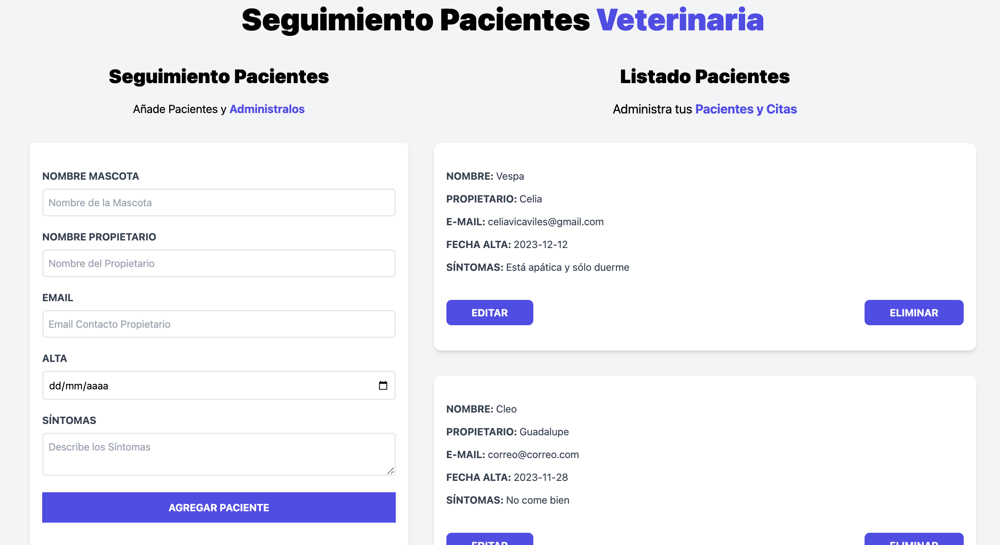

# Clínica Veterinaria - Gestión de Citas

Este proyecto es una aplicación web para la gestión de citas de una clínica veterinaria. Permite registrar, leer, editar y eliminar a los pacientes. Los datos de los pacientes se almacenan en el LocalStorage del navegador, por lo que no son persistentes.

## Funcionalidades

- Registro de pacientes con:
  - Nombre de la mascota
  - Nombre del propietario de la mascota
  - Email de contacto
  - Fecha de alta del paciente
  - Descripción de síntomas
- Edición y eliminación de pacientes

## Instalación

1. Clonar el proyecto: `git clone https://github.com/Celiaaviles/veterinaria-project.git`
2. Acceder al directorio: `cd veterinaria-project`
3. Instalar las dependencias: `npm install`
4. Iniciar el proyecto: `npm run dev`

## Demo

Puedes ver una demo del proyecto en [este enlace](https://ejemplo.com).

## Tecnologías utilizadas

- React
- Vite
- LocalStorage

## Capturas de pantalla

